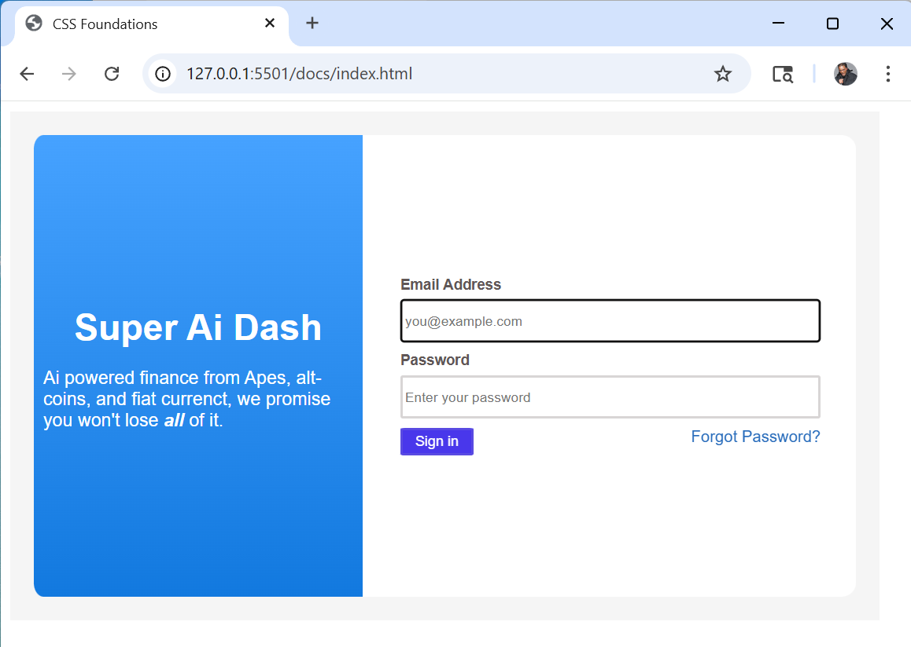
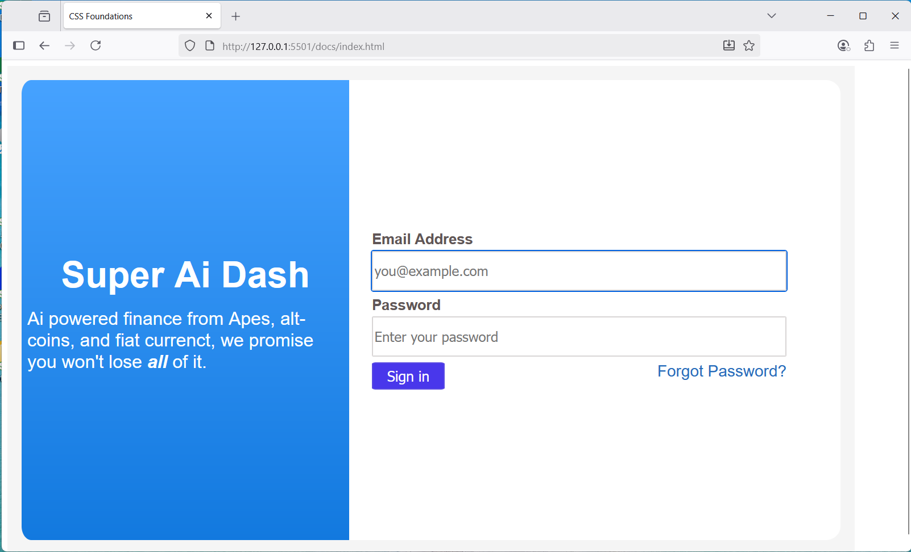

# lab5-css-foundations
COMP305 2025 Lab 5 CSS Practice

# Lab 5: Dice Super Ai Dash CSS

## Project Goals
The aim of this lab is to:
1. Teach me the basics of CSS
2. Be able to replicate an already built Super Ai Dash interface.
3. Be able to have the design scale to the size of the Viewport

## GitHub
https://github.com/jkelley678/lab5-css-foundations

## Implementation Approach
I decided to begin by separating the page into two columns where I could put  login info in the first column and the text boxes for email and password as well as the sign in button and forget passwrod link in the second. From there, I worked on centering, followed by making the page responsive to viewport size. Then I focused on the coloring and style of the page. All design decisions were to best replicate the replication.png we were given.

## Captures
What the page looks like in a Chrome browser:

What the page looks like in an Edge browser:

What the page looks like in a Firefox browser:

## Links
https://www.youtube.com/watch?v=lE6sme7SHj8&list=RDlE6sme7SHj8&start_radio=1: I find this to be a very good song. 
https://www.youtube.com/watch?v=S_iyhcomfrc: This is just to not forget your password again.
## License
This project is licensed under the MIT License - see [LICENSE.md](LICENSE.md) for
details.
## Author
Jackson Kelley
